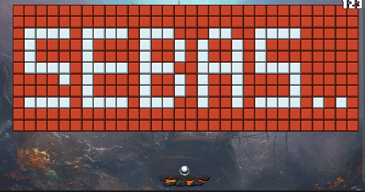
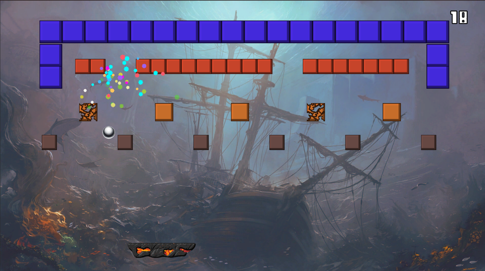

  <h1>Whirlwind Breaking Madness</h1>

 
  

**Table of content**
- [Game Summary](#game-summary)
- [Description](#description)
- [Visual Style](#visual-style)
- [Player Objectives](#player-objectives)

# Game Summary

**Common Information**

**Target Audience:** All ages  
**Genre:** Block Breaker  
**Engine:** Unity  
**Release Platform:** NA  
**Release Store:** NA  

# Description

Block Breaker, with visual effects and score system.

# Visual Style
Cartoony in various styles.

# Player Objectives
- Break all the squares in the scene
- Don't let the ball fall

